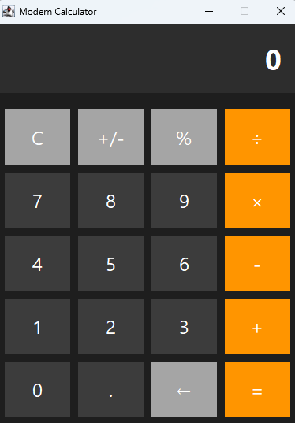

# 🧮 Modern Swing Calculator

<div align="center">


**A professional calculator application with modern UI using Java Swing and MVC pattern**

[Features](#-features) • [Installation](#-installation) • [Usage](#-usage) • [Testing](#-testing) • [License](#-license)

</div>

---

## 📋 Table of Contents

- [About](#-about)
- [Features](#-features)
- [Screenshots](#-screenshots)
- [Technologies](#-technologies)
- [Project Structure](#-project-structure)
- [Installation](#-installation)
- [Usage](#-usage)
- [Keyboard Shortcuts](#-keyboard-shortcuts)
- [Testing](#-testing)
- [Contributing](#-contributing)
- [License](#-license)
- [Author](#-author)

---

## 🎯 About

Modern Swing Calculator is a professional-grade calculator application built with Java Swing, demonstrating best practices in software development. The project showcases a clean MVC (Model-View-Controller) architecture, comprehensive testing, and a modern dark-themed user interface.

### Why This Project?

- ✅ **Educational**: Perfect for learning Java Swing and MVC pattern
- ✅ **Professional**: Production-ready code with proper error handling
- ✅ **Well-Tested**: Comprehensive unit tests with JUnit 5
- ✅ **Modern UI**: Dark theme with smooth hover effects
- ✅ **Precise**: BigDecimal for accurate decimal calculations

---

## ✨ Features

### 🏗️ Architecture & Design
- ✅ **MVC Pattern** - Clean separation of Model, View, and Controller
- ✅ **SOLID Principles** - Professional code organization
- ✅ **Clean Code** - Comprehensive JavaDoc and comments
- ✅ **English Naming** - All code follows Java naming conventions

### 🎨 UI/UX Features
- ✅ **Modern UI** - Dark theme with orange accents (iOS-inspired)
- ✅ **Hover Effects** - Interactive button animations
- ✅ **Keyboard Support** - Full keyboard navigation and input
- ✅ **Responsive Design** - Clean grid layout

### 🔢 Calculation Features
- ✅ **Basic Operations** - Addition, subtraction, multiplication, division
- ✅ **Scientific Functions** - Square root, power, trigonometry (sin, cos, tan)
- ✅ **Memory Functions** - M+, M-, MR, MC for storing values
- ✅ **Special Operations** - Sign toggle (+/-), percentage, decimal support
- ✅ **BigDecimal Precision** - Accurate decimal calculations (10 decimal places)

### 🛡️ Error Handling
- ✅ **Division by Zero Protection** - Prevents arithmetic errors
- ✅ **Invalid Input Handling** - Graceful error recovery
- ✅ **User-Friendly Messages** - Clear error dialogs

### 🧪 Testing
- ✅ **Unit Tests** - 14+ comprehensive tests for all operations
- ✅ **Edge Case Coverage** - Testing boundary conditions
- ✅ **Continuous Integration** - Ready for CI/CD pipelines

### 📝 Additional Features
- ✅ **Calculation History** - Track previous calculations (up to 50 entries)
- ✅ **Clear/Delete** - C for clear all, DEL for delete last digit
- ✅ **Chained Operations** - Support for complex calculations

---

## 📸 Screenshots



---

## 🛠️ Technologies

| Technology | Version | Purpose |
|------------|---------|---------|
| **Java** | 21 | Programming language |
| **Maven** | 3.9+ | Build automation |
| **Swing** | Built-in | GUI framework |
| **JUnit 5** | 5.10.0 | Unit testing |
| **BigDecimal** | Built-in | Precise calculations |

---

## 📁 Project Structure
```
calculator-maven-swing-mvc/
│
├── src/
│   ├── main/
│   │   └── java/
│   │       └── com/csaba79coder/calculator/
│   │           ├── CalculatorApplication.java      # Main entry point
│   │           ├── model/
│   │           │   └── Calculator.java             # Business logic
│   │           ├── view/
│   │           │   └── CalculatorFrame.java        # UI components
│   │           ├── controller/
│   │           │   └── CalculatorController.java   # Event handling
│   │           └── value/
│   │               ├── Operation.java              # Basic operations enum
│   │               └── ScientificOperation.java    # Scientific operations enum
│   │
│   └── test/
│       └── java/
│           └── com/csaba79coder/calculator/model/
│               └── CalculatorTest.java             # Unit tests
│
├── pom.xml                # Maven configuration
├── README.md              # This file
├── .gitignore             # Git ignore rules
└── LICENSE                # MIT License
```

---

## 🚀 Installation

### Prerequisites

- **Java Development Kit (JDK) 21** or higher
- **Apache Maven 3.9+**
- **Git** (optional, for cloning)

### Steps

1. **Clone the repository** (or download ZIP)
```bash
git clone https://github.com/Csaba79-coder/calculator-maven-swing-mvc.git
cd calculator-maven-swing-mvc
```

2. **Build the project**
```bash
mvn clean install
```

3. **Run the application**
```bash
# Option 1: Using Maven
mvn exec:java

# Option 2: Using JAR file
java -jar target/calculator-maven-swing-mvc-1.0-SNAPSHOT.jar
```

---

## 💻 Usage

### Basic Operations

1. **Launch** the calculator
2. **Click buttons** or use keyboard to input numbers
3. **Select operation** (+, -, ×, ÷)
4. **Press =** or Enter to calculate
5. **Press C** to clear

### Example Calculations
```
Simple: 5 + 3 = 8
Chained: 10 + 5 × 2 - 5 = 25
Decimal: 3.14 × 2 = 6.28
Percentage: 50% = 0.5
```

### Memory Functions

| Button | Function | Description |
|--------|----------|-------------|
| **MS** | Memory Store | Stores current value |
| **MR** | Memory Recall | Recalls stored value |
| **M+** | Memory Add | Adds to memory |
| **M-** | Memory Subtract | Subtracts from memory |
| **MC** | Memory Clear | Clears memory |

---

## ⌨️ Keyboard Shortcuts

| Key | Function |
|-----|----------|
| **0-9** | Number input |
| **+** | Addition |
| **-** | Subtraction |
| **\* or x** | Multiplication |
| **/** | Division |
| **Enter or =** | Calculate result |
| **. or ,** | Decimal point |
| **Backspace** | Delete last digit |
| **Esc or C** | Clear all |
| **%** | Percentage |

---

## 🧪 Testing

### Run All Tests
```bash
mvn test
```

### Run Specific Test
```bash
mvn test -Dtest=CalculatorTest#testAddition
```

### Test Coverage

The project includes 14+ unit tests covering:

- ✅ Initial state
- ✅ Digit input
- ✅ Basic operations (add, subtract, multiply, divide)
- ✅ Division by zero protection
- ✅ Decimal point handling
- ✅ Sign toggle
- ✅ Percentage calculation
- ✅ Reset functionality
- ✅ Chained operations
- ✅ Complex calculations

### Example Test Output
```
[INFO] Tests run: 14, Failures: 0, Errors: 0, Skipped: 0
[INFO] BUILD SUCCESS
```

---

## 🎨 Design

### Color Scheme

| Element | Color | Hex Code |
|---------|-------|----------|
| Background | Dark Gray | `#1E1E1E` |
| Display | Dark Gray | `#2D2D2D` |
| Number Buttons | Gray | `#3C3C3C` |
| Operations | Orange | `#FF9500` |
| Special Buttons | Light Gray | `#A5A5A5` |
| Text | White | `#FFFFFF` |

### UI Components

- **Display**: 36pt Segoe UI Bold
- **Buttons**: 24pt Segoe UI
- **Layout**: 5×4 Grid (5 rows, 4 columns)
- **Size**: 400×550 pixels
- **Spacing**: 10px gaps between elements

---

## 🔧 Configuration

### Maven Configuration

The project uses the following Maven plugins:

- **maven-compiler-plugin** (3.13.0) - Java compilation
- **maven-jar-plugin** (3.3.0) - JAR creation
- **maven-surefire-plugin** (3.2.5) - Test execution
- **exec-maven-plugin** (3.1.0) - Running from Maven

### Java Version
```xml
<properties>
    <maven.compiler.source>21</maven.compiler.source>
    <maven.compiler.target>21</maven.compiler.target>
</properties>
```

---

## 🤝 Contributing

Contributions are welcome! Please follow these steps:

1. **Fork** the repository
2. **Create** a feature branch (`git checkout -b feature/AmazingFeature`)
3. **Commit** your changes (`git commit -m 'Add some AmazingFeature'`)
4. **Push** to the branch (`git push origin feature/AmazingFeature`)
5. **Open** a Pull Request

### Code Style

- Follow Java naming conventions
- Add JavaDoc for public methods
- Write unit tests for new features
- Keep code clean and readable

---

## 📝 License

This project is licensed under the **MIT License** - see the [LICENSE](LICENSE) file for details.
```
MIT License

Copyright (c) 2025 Csaba79coder

Permission is hereby granted, free of charge, to any person obtaining a copy
of this software and associated documentation files (the "Software"), to deal
in the Software without restriction, including without limitation the rights
to use, copy, modify, merge, publish, distribute, sublicense, and/or sell
copies of the Software, and to permit persons to whom the Software is
furnished to do so, subject to the following conditions:

The above copyright notice and this permission notice shall be included in all
copies or substantial portions of the Software.

THE SOFTWARE IS PROVIDED "AS IS", WITHOUT WARRANTY OF ANY KIND, EXPRESS OR
IMPLIED, INCLUDING BUT NOT LIMITED TO THE WARRANTIES OF MERCHANTABILITY,
FITNESS FOR A PARTICULAR PURPOSE AND NONINFRINGEMENT.
```

---

## 👨‍💻 Author

**Csaba79coder**

- GitHub: [@Csaba79-coder](https://github.com/Csaba79-coder)
- Project Link: [calculator-maven-swing-mvc](https://github.com/Csaba79-coder/calculator-maven-swing-mvc)

---

## 🙏 Acknowledgments

- Inspired by iOS Calculator design
- Built with Java Swing
- Tested with JUnit 5
- Maven for build automation

---

## 📊 Project Stats


---

<div align="center">

**⭐ If you like this project, please give it a star! ⭐**

Made with ❤️ by Csaba79coder

</div>